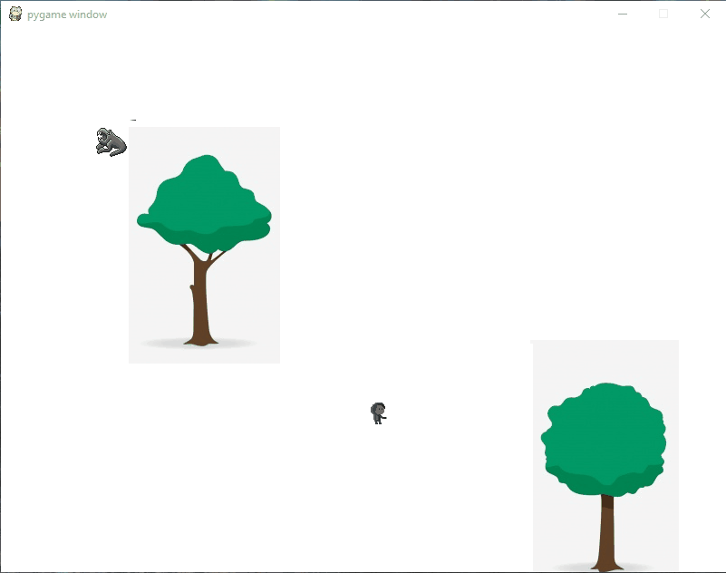

# Darkness
A 2D Adventure/Puzzle Video Game in Pygame. Still requires a lot of development.

## Concept
A boy is lost at night in total darkness. He must explore the world around him with nothing but a flashlight who's batteries are draining.
There are a variety of shadow monsters on the lose who want to eat him. His only defense is to shine his light at them, causing them to flee.
In a race against his draining batteries, he must find his way through the maze without being eaten alive.  

The current state of the game.

## To-Do<ul>
<li>Implement a functioning flashlight</li>
<li>Add sprite animations</li>
<li>Design a map for level one</li>
<li>Design maps for further levels</li>
<li>Add audio to increase immersion</li>

## Contact
If you have any questions about this project, please email me at dylkinder@gmail.com.

Enjoy!
